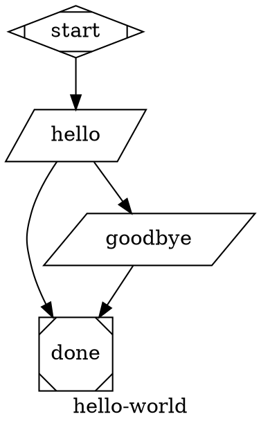

# attractor-phoenix

`attractor-phoenix` is a demo app whose primary deliverable is the `AttractorEx` library.

## Project Structure

1. `lib/attractor_ex/` - standalone Attractor-style DOT pipeline engine (the main artifact).
2. `lib/attractor_phoenix_web/live/` - Phoenix LiveView UI demonstrating the library.
3. `assets/js/pipeline_builder.js` - graph-builder interactions for the demo UI.

## AttractorEx First

`AttractorEx` is implemented to be independent from Phoenix/web modules.

1. No `AttractorPhoenix*` references inside `lib/attractor_ex`.
2. No `AttractorPhoenixWeb*` references inside `lib/attractor_ex`.
3. The public API is `AttractorEx.run/3`.

See dedicated library docs: [lib/attractor_ex/README.md](C:\Users\ex_ra\code\ai-factory\attractor-phoenix\lib\attractor_ex\README.md)

## Demo UI

The Phoenix app provides:

1. Live graphical pipeline builder.
2. DOT text editing and round-trip sync.
3. Pipeline execution and output display.

## Phoenix Setup and Run

Prerequisites:

1. Elixir/Erlang installed.
2. Node.js installed (for asset tooling).

Setup:

```bash
mix deps.get
mix assets.build
```

Run:

```bash
mix phx.server
```

Open: `http://localhost:4000`

Optional one-shot setup:

```bash
mix setup
```

## Git Quality Hooks

Install repo-managed Git hooks so local commits and pushes enforce the same CI gates:

```bash
powershell -ExecutionPolicy Bypass -File scripts/setup-githooks.ps1
```

or:

```bash
bash scripts/setup-githooks.sh
```

Installed hooks (platform-independent dispatcher with PowerShell or POSIX shell):

1. `pre-commit`: `mix format --check-formatted` and `mix compile --warnings-as-errors`
2. `pre-push`: `mix test --warnings-as-errors` and `mix coveralls.json`

## Default Pipeline



## Spec Reference

This project follows and tests against strongDM Attractor concepts/spec:

1. https://github.com/strongdm
2. https://github.com/strongdm/attractor
3. https://github.com/strongdm/attractor/blob/main/attractor-spec.md

Upstream baseline currently tracked by this repo:

1. `strongdm/attractor` commit: `2f892efd63ee7c11f038856b90aae57c067b77c2` (2026-02-19)
2. Local reference clone path: `_attractor_reference`
3. Update reminder: re-check upstream spec changes periodically and update tests/implementation when this hash changes.

## LLM Node Configuration (`codergen`)

`box`-shaped nodes (or `type="codergen"`) execute through `AttractorEx.Handlers.Codergen`.

Current configuration model:

1. Node prompt comes from `prompt` (fallback: `label`).
2. `$goal` in prompt is expanded from graph attribute `goal`.
3. Preferred path: unified LLM client via `llm_client: %AttractorEx.LLM.Client{...}`.
4. Legacy path: backend module via `codergen_backend: YourBackendModule`.
5. Legacy backend contract: `run(node, prompt, context) :: String.t() | AttractorEx.Outcome.t()`.

Unified client request fields are read from node attrs:

1. `llm_model` (required for unified path, or pass `opts[:llm_model]`)
2. `llm_provider` (optional if client default provider is set, or pass `opts[:llm_provider]`)
3. `reasoning_effort` (default `"high"`)
4. `max_tokens` and `temperature` (optional)

Example unified client:

```elixir
llm_client = %AttractorEx.LLM.Client{
  providers: %{"openai" => MyApp.OpenAIAdapter},
  default_provider: "openai"
}

{:ok, result} =
  AttractorEx.run(dot_source, %{}, llm_client: llm_client)
```

Example legacy backend:

```elixir
defmodule MyApp.LLMBackend do
  alias AttractorEx.Outcome

  def run(node, prompt, _context) do
    # Replace this with OpenAI/Anthropic/etc API call.
    response = "[LLM] #{node.id}: #{prompt}"
    Outcome.success(%{"responses" => %{node.id => response}}, "LLM call complete")
  end
end
```

Example run:

```elixir
{:ok, result} =
  AttractorEx.run(dot_source, %{}, codergen_backend: MyApp.LLMBackend)
```

Notes:

1. If no backend is passed, simulation backend is used.
2. Codergen writes `prompt.md`, `response.md`, and `status.json` per stage under run logs.

## Testing and Coverage

```bash
mix test
mix coveralls
mix coveralls.html
```

Current `AttractorEx`-focused coverage is configured via `coveralls.json` and targets >= `90%`.

## Notes (Windows)

You may see a Phoenix LiveView symlink warning during compile/tests on Windows (`:eperm`).
It is non-blocking for this repo unless colocated LiveView JS symlink behavior is required.
