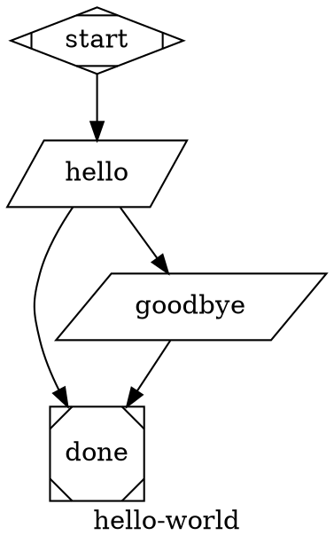

# attractor-phoenix
[](https://dl.circleci.com/status-badge/redirect/gh/Alezrik/attractor-phoenix/tree/main)

`attractor-phoenix` is a Phoenix application built to showcase and validate `AttractorEx`, an Elixir implementation of an Attractor-style workflow engine. It gives teams a clear way to define work as a graph of stages, run that workflow end to end, inspect the outcome of each step, and manage real operational moments such as retries, human approvals, tool execution, and LLM-backed generation.

This repository combines the core engine with a polished visual experience for designing and explaining pipelines. The `AttractorEx` library is the primary product artifact, while the Phoenix UI makes the system easier to understand, demo, and evaluate by turning workflow logic, execution state, and spec-compliance work into something visible and concrete.

The current Phoenix experience centers around three LiveView surfaces:

1. `/` dashboard for run telemetry and inspection.
2. `/builder` for visual DOT authoring, execution, and now save/load integration with the library.
3. `/library` for administering reusable pipeline presets that can be pushed back into the builder.

## Project Structure

1. `lib/attractor_ex/` - standalone Attractor-style DOT pipeline engine (the main artifact).
2. `lib/attractor_ex_phx/` - Phoenix adapter layer that plugs the web app into `AttractorEx` through HTTP, PubSub, and channel-friendly integration seams.
3. `lib/attractor_phoenix_web/live/` - Phoenix LiveView UI demonstrating the library.
4. `assets/js/pipeline_builder.js` - graph-builder interactions for the demo UI.

## AttractorEx First

`AttractorEx` is implemented to be independent from Phoenix/web modules.

1. No `AttractorPhoenix*` references inside `lib/attractor_ex`.
2. No `AttractorPhoenixWeb*` references inside `lib/attractor_ex`.
3. Phoenix integration code now lives under `lib/attractor_ex_phx/`.
4. The public API is `AttractorEx.run/3`.

See dedicated library docs: [lib/attractor_ex/README.md](lib/attractor_ex/README.md)
Published overview: https://alezrik.github.io/attractor-phoenix/overview.html

## Documentation

This repository now ships a proper ExDoc site for `AttractorEx` and keeps the spec-alignment documents inside that published documentation set.

Primary documentation locations:

1. Published docs site: https://alezrik.github.io/attractor-phoenix/overview.html
2. Local ExDoc site: `docs/index.html` after running `mix docs`
3. ExDoc guides and generated site output: `docs/`
4. Library overview source: `lib/attractor_ex/README.md`
5. Spec compliance references:
   - `lib/attractor_ex/ATTRACTOR_SPEC_COMPLIANCE.md`
   - `lib/attractor_ex/CODING_AGENT_LOOP_COMPLIANCE.md`
   - `lib/attractor_ex/UNIFIED_LLM_SPEC_COMPLIANCE.md`

Recommended entry points:

1. Start with the published overview page.
2. Use the API reference and module sidebar from the published site for source-level navigation.
3. Use the `lib/attractor_ex/*.md` files in this repo when editing or reviewing spec-compliance changes.

Documentation commands:

```bash
mix docs
mix precommit
```

Documentation policy:

1. Treat documentation as part of the product, not an afterthought.
2. Any `AttractorEx` behavior change should update the relevant module docs, guides, and compliance matrix in the same change.
3. If you add or change a handler, public API, HTTP endpoint, LLM/agent primitive, or spec-facing behavior, update the docs before considering the work complete.
4. Keep examples aligned with the current implementation and tests.

## Demo UI

The Phoenix app provides:

1. Live graphical pipeline builder.
2. DOT text editing and round-trip sync.
3. Pipeline execution and output display.
4. A pipeline library admin at `/library` for creating, editing, deleting, and loading saved builder presets.
5. Builder-side save/load workflow so a pipeline can be stored from `/builder` and reopened via `/builder?library=:id`.
6. Phoenix-native push integration through PubSub topics and WebSocket channels.

### Library Workflow

Use the library when you want reusable pipeline templates rather than one-off builder drafts.

1. Open `/builder`, author or modify a pipeline, and use the `Save to Library` action.
2. Provide a library name and description alongside the DOT and JSON context payload.
3. Open `/library` to manage all saved pipelines.
4. Use `Load in Builder` from `/library` to reopen a saved entry in the visual editor.
5. Use `/builder?library=:id` for a direct deep link into a specific saved pipeline.

Library entries are stored in a local JSON-backed file so the feature works without introducing an Ecto/Repo dependency.

## Phoenix Setup and Run

Prerequisites:

1. Elixir/Erlang installed.
2. Node.js installed (for asset tooling).

Setup:

```bash
mix deps.get
mix assets.build
```

Run:

```bash
mix phx.server
```

Open: `http://localhost:4000`

Primary UI routes:

1. `http://localhost:4000/` dashboard
2. `http://localhost:4000/builder` pipeline builder
3. `http://localhost:4000/library` pipeline library admin

Optional one-shot setup:

```bash
mix setup
```

## Git Quality Hooks

Install repo-managed Git hooks so local commits and pushes enforce the same CI gates:

```bash
powershell -ExecutionPolicy Bypass -File scripts/setup-githooks.ps1
```

or:

```bash
bash scripts/setup-githooks.sh
```

Installed hooks (platform-independent dispatcher with PowerShell or POSIX shell):

1. `pre-commit`: `mix format --check-formatted`, `mix compile --warnings-as-errors`, and `mix credo --strict`
2. `pre-push`: `mix precommit` (including the coverage gate) and `mix dialyzer --format short`

## Default Pipeline



## Spec Reference

This project follows and tests against strongDM Attractor concepts/spec:

1. https://github.com/strongdm
2. https://github.com/strongdm/attractor
3. https://github.com/strongdm/attractor/blob/main/attractor-spec.md
4. Local compliance matrix: `lib/attractor_ex/ATTRACTOR_SPEC_COMPLIANCE.md`
5. Unified LLM compliance matrix: `lib/attractor_ex/UNIFIED_LLM_SPEC_COMPLIANCE.md`

Upstream baseline currently tracked by this repo:

1. `strongdm/attractor` commit: `2f892efd63ee7c11f038856b90aae57c067b77c2` (2026-02-19)
2. Local reference clone path: `_attractor_reference`
3. Update reminder: re-check upstream spec changes periodically and update tests/implementation when this hash changes.

## Unified LLM Client (spec implementation status)

`AttractorEx.LLM.Client` now implements the spec-defined low-level foundation for a unified client:

1. Provider routing by request provider or client default provider.
2. Request middleware for blocking completion flows.
3. Streaming middleware for stream flows.
4. Provider adapter contract with `complete/1` and optional `stream/1`, plus native OpenAI, Anthropic, and Gemini adapters.
5. Unified request model fields including `top_p`, `stop_sequences`, `response_format`, cache hints, and retry policy overrides.
6. Unified stream event envelope via `AttractorEx.LLM.StreamEvent`, including incremental `:object_delta` events for typed JSON streams.
7. Typed `AttractorEx.LLM.Error` failures and `AttractorEx.LLM.RetryPolicy` backoff/retry handling.

Current scope is intentionally low-level and adapter-agnostic. See the detailed matrix in `lib/attractor_ex/UNIFIED_LLM_SPEC_COMPLIANCE.md` or the published page at https://alezrik.github.io/attractor-phoenix/unified_llm_spec_compliance.html.

## LLM Node Configuration (`codergen`)

`box`-shaped nodes (or `type="codergen"`) execute through `AttractorEx.Handlers.Codergen`.

Current configuration model:

1. Node prompt comes from `prompt` (fallback: `label`).
2. `$goal` in prompt is expanded from graph attribute `goal`.
3. Preferred path: unified LLM client via `llm_client: %AttractorEx.LLM.Client{...}`.
4. Legacy path: backend module via `codergen_backend: YourBackendModule`.
5. Legacy backend contract: `run(node, prompt, context) :: String.t() | AttractorEx.Outcome.t()`.

Unified client request fields are read from node attrs:

1. `llm_model` (required for unified path, or pass `opts[:llm_model]`)
2. `llm_provider` (optional if client default provider is set, or pass `opts[:llm_provider]`)
3. `reasoning_effort` (default `"high"`)
4. `max_tokens` and `temperature` (optional)

Example unified client:

```elixir
llm_client = %AttractorEx.LLM.Client{
  providers: %{"openai" => MyApp.OpenAIAdapter},
  default_provider: "openai"
}

{:ok, result} =
  AttractorEx.run(dot_source, %{}, llm_client: llm_client)
```

Example legacy backend:

```elixir
defmodule MyApp.LLMBackend do
  alias AttractorEx.Outcome

  def run(node, prompt, _context) do
    # Replace this with OpenAI/Anthropic/etc API call.
    response = "[LLM] #{node.id}: #{prompt}"
    Outcome.success(%{"responses" => %{node.id => response}}, "LLM call complete")
  end
end
```

Example run:

```elixir
{:ok, result} =
  AttractorEx.run(dot_source, %{}, codergen_backend: MyApp.LLMBackend)
```

Notes:

1. If no backend is passed, simulation backend is used.
2. Codergen writes `prompt.md`, `response.md`, and `status.json` per stage under run logs.

## Testing and Coverage

```bash
mix test
mix attractor.http
mix attractor.http.hello
mix bench
mix coveralls
mix coveralls.html
mix docs
```

Current `AttractorEx`-focused coverage is configured via `coveralls.json` and is enforced locally by `mix precommit` via `mix coverage.gate`, targeting >= `90%`.

The HTTP surface also has a dedicated lane so transport and contract checks can
run independently from the broader suite:

```bash
mix attractor.http
mix attractor.http --trace
mix attractor.http.hello
```

`mix attractor.http.hello` runs in `MIX_ENV=api_test` and targets `qa/http_hello/`,
so it does not join the default `mix test` file sweep.

## Focused Benchmarks

Focused benchmark scripts live under `bench/` so scale and performance probes stay out of the normal `mix test` loop.

```bash
mix bench
mix bench bench/hello_world.exs
```

The starter script at `bench/hello_world.exs` is intentionally small. It exists to prove the benchmark lane, dependencies, and dedicated `MIX_ENV=bench` setup before deeper library or load scenarios are added.

## Notes (Windows)

You may see a Phoenix LiveView symlink warning during compile/tests on Windows (`:eperm`).
It is non-blocking for this repo unless colocated LiveView JS symlink behavior is required.
