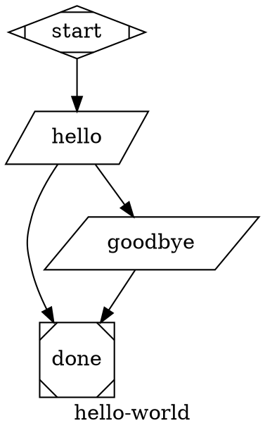

# attractor-phoenix

`attractor-phoenix` is a demo app whose primary deliverable is the `AttractorEx` library.

## Project Structure

1. `lib/attractor_ex/` - standalone Attractor-style DOT pipeline engine (the main artifact).
2. `lib/attractor_phoenix_web/live/` - Phoenix LiveView UI demonstrating the library.
3. `assets/js/pipeline_builder.js` - graph-builder interactions for the demo UI.

## AttractorEx First

`AttractorEx` is implemented to be independent from Phoenix/web modules.

1. No `AttractorPhoenix*` references inside `lib/attractor_ex`.
2. No `AttractorPhoenixWeb*` references inside `lib/attractor_ex`.
3. The public API is `AttractorEx.run/3`.

See dedicated library docs: [lib/attractor_ex/README.md](C:\Users\ex_ra\code\ai-factory\attractor-phoenix\lib\attractor_ex\README.md)

## Demo UI

The Phoenix app provides:

1. Live graphical pipeline builder.
2. DOT text editing and round-trip sync.
3. Pipeline execution and output display.

## Phoenix Setup and Run

Prerequisites:

1. Elixir/Erlang installed.
2. Node.js installed (for asset tooling).

Setup:

```bash
mix deps.get
mix assets.build
```

Run:

```bash
mix phx.server
```

Open: `http://localhost:4000`

Optional one-shot setup:

```bash
mix setup
```

## Default Pipeline



## Spec Reference

This project follows and tests against strongDM Attractor concepts/spec:

1. https://github.com/strongdm
2. https://github.com/strongdm/attractor
3. https://github.com/strongdm/attractor/blob/main/attractor-spec.md

Upstream baseline currently tracked by this repo:

1. `strongdm/attractor` commit: `2f892efd63ee7c11f038856b90aae57c067b77c2` (2026-02-19)
2. Local reference clone path: `_attractor_reference`
3. Update reminder: re-check upstream spec changes periodically and update tests/implementation when this hash changes.

## Testing and Coverage

```bash
mix test
mix coveralls
mix coveralls.html
```

Current `AttractorEx`-focused coverage is configured via `coveralls.json` and targets >= `90%`.

## Notes (Windows)

You may see a Phoenix LiveView symlink warning during compile/tests on Windows (`:eperm`).
It is non-blocking for this repo unless colocated LiveView JS symlink behavior is required.
